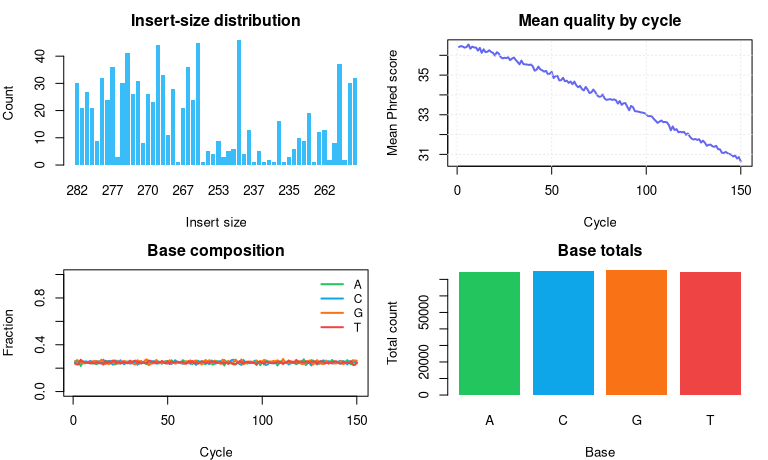
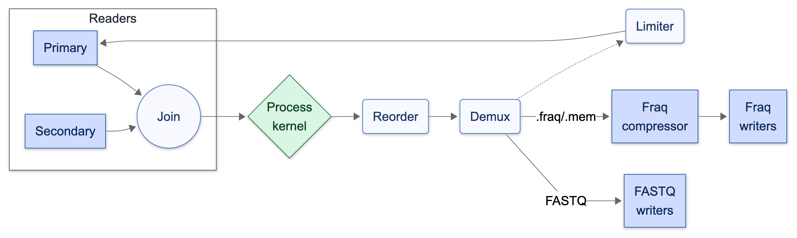

fraq: A high-throughput extensible toolkit for processing fastq data
================

`fraq` is a high-throughput extensible toolkit for processing fastq
data. It builds on Intel TBB’s flow graph to orchestrate concurrent I/O
and data processing. This means that throughput can be as fast as
compression and disk speed allow.

The package ships with a suite of predefined ‘kernels’ for common FASTQ
tasks, and its extension system lets you drop in custom kernels so you
can cover almost any FASTQ processing workflow without giving up
performance.

## Why use fraq?

- **Concurrent I/O and data processing.** As fast as compression and
  disk speed allow
- **Extensibility.** You can drop in your own kernels for almost any
  fastq processing task (see `Extension system` sections below)
- **Support for gzip, zstd and pipes.** See `Supported formats` section

## Quick start

**Install**

Install development version with
`remotes::install_github("traversc/fraq")`

Install the stable Bioconductor release with:

``` r
if (!requireNamespace("BiocManager", quietly = TRUE)) {
    install.packages("BiocManager")
}
BiocManager::install("fraq")
```

## Pre-built functions

fraq ships with a collection of ready-to-go kernels that cover common
preprocessing steps:

- `fraq_downsample()` - deterministically retain a target fraction of
  reads (paired-end aware)
- `fraq_convert()` - re-encode reads between any supported formats
- `fraq_concat()` - glue multiple inputs together
- `fraq_chunk()` - split streams into chunk-numbered files with a
  suffix-driven format
- `fraq_slice()` - keep the first `limit` reads or select specific read
  indices
- `fraq_count_barcodes()` - tally barcode hits with optional
  reverse-complement handling
- `fraq_demux()` - shard reads into files derived from a `{barcode}`
  placeholder
- `fraq_quality_filter()` - drop read groups that fail read quality
  thresholds
- `fraq_merge_pairs()` - overlap paired reads to create consensus
  single-end reads while recording merge stats
- `fraq_trim_adapters()` - trim adapters from the first mate (and
  optionally drop untrimmed records)
- `fraq_summary()` - compute per-base stats, histograms, and insert-size
  estimates

## Walkthroughs with synthetic data

For illustration purposes, we create a small synthetic dataset.

``` r
set.seed(314156)
example_dir <- file.path(tempdir(), "fraq_function_examples")
dir.create(example_dir, showWarnings = FALSE, recursive = TRUE)
R1 <- file.path(example_dir, "example_R1.fastq")
R2 <- file.path(example_dir, "example_R2.fastq")
generate_random_fastq(c(R1, R2), n_reads = 2000, read_length = 150)
example_reads <- c(R1, R2)
```

### Summarization

`fraq_summary()` rolls up QC tables for the R1/R2 fastq pairs.

``` r
library(fraq)
# summarize quality metrics
qc <- fraq_summary(c(R1, R2))
```

<figure>

<figcaption aria-hidden="true">Quick QC overview from
<code>fraq_summary()</code>.</figcaption>
</figure>

### Filtering

Various filtering operations are illustrated below. Here we downsample
to reduce dataset size and then discard mates whose mean PHRED drops
below 22 or accumulate more than 6 bases with PHRED \< 18 (roughly 10%
of reads will be filtered).

``` r
filter_dir <- file.path(example_dir, "filtering")
dir.create(filter_dir, showWarnings = FALSE)

downsampled_reads <- file.path(
    filter_dir,
    c("example_R1_ds.fastq.gz", "example_R2_ds.fastq.gz")
)
fraq_downsample(example_reads, downsampled_reads, amount = 0.50, nthreads = 2L)

quality_reads <- file.path(
    filter_dir,
    c("example_R1_q20.fastq.gz", "example_R2_q20.fastq.gz")
)
fraq_quality_filter(
    input = downsampled_reads,
    output = quality_reads,
    min_mean_quality = 22,
    max_low_q_bases = 6L,
    low_q_threshold = 18L,
    nthreads = 2L
)

filtered_stats <- fraq_summary(quality_reads, nthreads = 2L)$basic_stats_R1
filtered_stats
```

    ##   total_sequences total_bases seq_len_min seq_len_mean seq_len_max gc_percent
    ## 1             970      145500         150          150         150   50.00619

### Splitting

Splitting workflows either direct reads into barcode-specific files,
chunk long runs into bite-sized batches, or simply inspect barcode
usage.

``` r
split_dir <- file.path(example_dir, "splitting")
if (dir.exists(split_dir)) unlink(split_dir, recursive = TRUE)
dir.create(split_dir, showWarnings = FALSE)
barcode_set <- c("ACGTAA", "TTGGCC")
demux_patterns <- file.path(
    split_dir,
    c("R1_{barcode}.fastq.gz", "R2_{barcode}.fastq.gz")
)
```

**Barcode-guided demultiplexing**

Demux looks for barcode/adapter/primer sequence at the start of the
first given fastq file.

``` r
fraq_demux(
    input = example_reads,
    output_format = demux_patterns,
    barcodes = barcode_set,
    max_distance = 1L,
    nthreads = 2L
)
basename(sort(
    list.files(split_dir, pattern = "R1_.*\\.fastq.gz$", full.names = TRUE)
))
```

    ## [1] "R1_ACGTAA.fastq.gz"   "R1_NO_MATCH.fastq.gz" "R1_TTGGCC.fastq.gz"

**Fixed-size chunking**

`fraq_chunk` splits reads into fixed-size batches with incremental file
names.

``` r
chunk_prefix <- file.path(split_dir, "chunk_demo")
fraq_chunk(
    input = example_reads[1],
    output_prefix = chunk_prefix,
    output_suffix = "gz",
    chunk_size = 200,
    nthreads = 2L
)
basename(sort(
    list.files(
        split_dir,
        pattern = "chunk_demo_chunk.+\\.fastq.gz$",
        full.names = TRUE
    )
))
```

    ##  [1] "chunk_demo_chunk0.fastq.gz" "chunk_demo_chunk1.fastq.gz"
    ##  [3] "chunk_demo_chunk2.fastq.gz" "chunk_demo_chunk3.fastq.gz"
    ##  [5] "chunk_demo_chunk4.fastq.gz" "chunk_demo_chunk5.fastq.gz"
    ##  [7] "chunk_demo_chunk6.fastq.gz" "chunk_demo_chunk7.fastq.gz"
    ##  [9] "chunk_demo_chunk8.fastq.gz" "chunk_demo_chunk9.fastq.gz"

**Barcode counting**

Barcode counting looks for sequence substrings anywhere in the fastq
reads and outputs a data frame of counts.

``` r
fraq_count_barcodes(
    input = example_reads,
    barcodes = barcode_set,
    max_distance = 0L,
    allow_revcomp = FALSE,
    nthreads = 2L
)
```

    ##       barcode count
    ## 1    NO_MATCH  1734
    ## 2      TTGGCC   132
    ## 3      ACGTAA   126
    ## 4 MULTI_MATCH     8

### Modification

Format conversion, adapter trimming, consensus merging, etc.

``` r
mod_dir <- file.path(example_dir, "modification")
if (dir.exists(mod_dir)) unlink(mod_dir, recursive = TRUE)
dir.create(mod_dir, showWarnings = FALSE)
```

**Convert between formats**

Re-wrap the paired-end files in Zstandard-compressed FASTQ.

``` r
converted_fastq <- file.path(
    mod_dir,
    c("example_R1.fastq.zst", "example_R2.fastq.zst")
)
fraq_convert(example_reads, converted_fastq, nthreads = 2L)
```

**Concatenate files**

Combine the converted shards into a single gzip-compressed stream.

``` r
concatenated <- file.path(mod_dir, "example_all.fastq.gz")
fraq_concat(converted_fastq, concatenated, nthreads = 2L)
```

**Merge overlapping pairs**

Generate consensus single-end reads while keeping optional unmerged
outputs.

``` r
merged_reads <- file.path(mod_dir, "example_merged.fastq")
unmerged_reads <- file.path(
    mod_dir,
    c("example_unmerged_R1.fastq", "example_unmerged_R2.fastq")
)
fraq_merge_pairs(
    input = example_reads,
    output_merged = merged_reads,
    output_unmerged = unmerged_reads,
    min_overlap = 20L,
    max_mismatch_rate = 0.05,
    nthreads = 2L
)
```

    ## $merged_reads
    ## [1] 648
    ## 
    ## $unmerged_reads
    ## [1] 1352
    ## 
    ## $mean_insert_size
    ## [1] 267.7454
    ## 
    ## $sd_insert_size
    ## [1] 10.25771
    ## 
    ## $mean_overlap
    ## [1] 32.25463
    ## 
    ## $mean_mismatch_rate
    ## [1] 0

**Trim adapters**

Remove adapter prefixes from R1 (and optionally drop untrimmed reads).

``` r
trimmed_reads <- file.path(
    mod_dir,
    c("example_trimmed_R1.fastq", "example_trimmed_R2.fastq")
)
fraq_trim_adapters(
    input = example_reads,
    output = trimmed_reads,
    adapters = "ACTAC",
    max_distance = 1L,
    filter_untrimmed = FALSE,
    nthreads = 2L
)
```

    ##      adapter count
    ## 1 NO_ADAPTER  1973
    ## 2      ACTAC    27

## Supported formats

fraq chooses formats from file names, so the extension you supply
controls how data is decoded and encoded.

- `.fastq`, `.fq` - Plain FASTQ (read/write). Fastest path but no
  compression.
- `.fastq.gz` - Gzip-compressed FASTQ (read/write). Uses zlib; tune via
  `fraq_options("gzip_compress_level")`.
- `.fastq.zst` - Zstd-compressed FASTQ (read/write). Uses bundled zstd;
  tune via `fraq_options("zstd_compress_level")`.
- `.fraq` - Chunked binary container (read/write). Designed for
  multithreaded IO and compression; see [FRAQ file
  format](#fraq-file-format) for layout details. FRAQ is a binary,
  block-compressed format layered on top of bundled zstd so it is both
  more storage-efficient and faster to stream than textual FASTQ.
- `.mem` - In-memory `.fraq` (read/write). Lifetime is limited to the
  current R session.
- `.fifo` - POSIX named pipes on Linux/macOS (read/write). Useful for
  streaming data between CLI programs.

## Extension system: flow graph overview

The `fraq_run()` pipeline wires a TBB flow graph so that IO and data
flow happen concurrently with data processing. A high-level view looks
like this:



Each block of fastq is read from `Primary Reader` (for the first mate
R1) and `Secondary Readers` (for R2 or additional fastq files). The key
node in this graph is the `Process Kernel`. It takes fastq records
(i.e. R1 and R2 reads), processes or alters them, decides whether to
keep them or not (filtering) and outputs any number of fastq records
(demux and splitting). This simple pattern naturally supports lots of
different fastq processing operations and can be customized.

## Extension system: writing a custom kernel with Rcpp

If the prebuilt kernels are insufficient, you can write your own via an
Rcpp script. You supply a lambda to `fraq::run`, and the runtime handles
all batching, IO, and parallelism. More information can be found in
`?fraq_rcpp_template`.

Below is an example that keeps only reads whose GC fraction falls in a
window (default 35-65%).

``` cpp
// [[Rcpp::depends(fraq)]]
#include <Rcpp.h>
#include <fraq.h>

double calc_gc_content(const std::string &s) {
    double gc = 0.0;
    for(char c : s) { if(c == 'G' || c == 'C') gc += 1.0 ; }
    return gc / (double) s.size();
}

// [[Rcpp::export(rng=false)]]
void fraq_gc_filter(std::vector<std::string> input,
                    std::vector<std::string> output,
                    double gc_min = 0.35, double gc_max = 0.65) {
  
    auto gc_filter_kernel = [&](fraq::input_t reads, size_t read_index)
        -> fraq::output_t {
    for(auto & read : reads) {
        double gc = calc_gc_content(read.seq);
        if(gc < gc_min || gc > gc_max) return {};
    }
    return fraq::zip(output, std::move(reads));
    };
  
    fraq::FraqRunConfig cfg;
    cfg.zstd_compress_level = 5;
    int nthreads = 4;
    fraq::run(input, gc_filter_kernel, nthreads, cfg);
}
```

All `fraq` classes are transparent structures with no private members,
built on standard library types.

- A `Read` is a struct with three strings: `name`, `seq`, and `qual`
  containing read info for a single mate
- `input_t` is a vector of `Read`’s representing a single fastq record
  (i.e. R1 and R2 reads)
- `output_t` is a `std::vector` of output paths / Reads

Compile via `Rcpp::sourceCpp()` then in R you can call your custom
kernel as a normal function. The extensions on the output paths decide
output format automatically.

``` r
input  <- c("sample_R1.fastq.gz", "sample_R2.fastq.gz")
output <- c("filtered_R1.fastq.zst", "filtered_R2.fastq.zst")
fraq_gc_filter(input, output, gc_min = 0.30, gc_max = 0.70)
```

### Some important tips when building custom kernels

- You are still responsible for writing safe C++
- Avoid interacting with the R API or relying on `Rcpp` classes; if your
  kernel interacts with R, you **must** use `nthreads = 1`

### Streaming with named pipes

You can use named pipes (Linux/Mac only - Windows is not supported) to
stream input and output directly into other command line programs.

Below is an example using `fraq_downsample` on input fastqs (random
fastqs in this example) and streaming the output directly to `bwa-mem2`.

**downsample_fifo.R**

``` r
library(fraq)
generate_random_fastq("R1.fastq")
generate_random_fastq("R2.fastq")
fraq_downsample(input=c("R1.fastq", "R2.fastq"),
                output=c("ds_R1.fastq.fifo", "ds_R2.fastq.fifo"),
                amount = 0.25, nthreads = 5L)
```

In bash (Linux/macOS), create the named pipes first before any
operations:

``` bash
HG38_REF=/path/to/hg38.fa.gz
mkfifo ds_R1.fastq.fifo ds_R2.fastq.fifo
Rscript downsample_fifo.R &
bwa-mem2 mem -t 8 $HG38_REF ds_R1.fastq.fifo ds_R2.fastq.fifo > output.sam
```

> Windows users should stick with regular files or platform-specific
> piping; `.fifo` paths are not available there.

## Tuning and threading

Global knobs live behind `fraq_options()`:

``` r
fraq_options("blocksize")          # current block size (default: 65535 reads)
```

    ## [1] 65535

``` r
fraq_options("blocksize", 16384L)  # shrink batches when running small tests
```

    ## [1] 65535

``` r
fraq_options("zstd_compress_level", 6L)
```

    ## [1] 3

``` r
fraq_options("gzip_compress_level", 4L)
```

    ## [1] 6

Each kernel also accepts `nthreads`. Internally, fraq caps the TBB
scheduler to the requested parallelism.

## FRAQ file format

The `.fraq` container stores FASTQ reads in independent blocks so that
IO and block-level compression can run concurrently. Each block holds up
to 65,535 reads (`fraq_options("blocksize")`) and stores block-level
info such as zstd compression, name-prefix factoring, and optional
nucleotide bit-packing.

FRAQ takes inspiration from the Nucleotide Archival Format (NAF) by
concatenating nucleotide and quality payloads before compressing them
with zstd (improving compression efficiency), following the approach
described by Kryukov et al. (2019). FRAQ differs by block compressing
the stream, which enables multithreaded compression, streaming and
tailoring the layout specifically to the FASTQ format instead of being
more general.

**Specification**

- **File header (16 bytes).** Bytes 1-4 are the ASCII magic `FRAQ`.
  Bytes 5-14 are reserved (currently zero). Byte 15 records the writer’s
  endianness (mixed endianness is rejected in v1), and byte 16 is the
  format version (currently `0x01`).
- **Block header.** Every block begins with a 32-bit metadata word that
  packs 11 two-bit codes plus a single bit for `use_bit_pack`. The codes
  describe the byte-width (1/2/4/8) used for each scalar that follows so
  the block stays compact regardless of read count or payload size.
- **Scalar section.** After the metadata word come nine unsigned
  integers whose widths are dictated by the codes: `num_reads`,
  `uncompressed_names_size`, `uncompressed_seqs_size`,
  `name_prefix_size`, and the byte sizes of the five compressed buffers
  (`compressed_name_lengths`, `compressed_names`,
  `compressed_seq_lengths`, `compressed_seqs`, `compressed_quals`).
- **Payload order.** The payload immediately follows the scalars:
  1.  `name_prefix` - a raw string that all reads share (for example the
      sample identifier preceding `/1` or `/2`).
  2.  `compressed_name_lengths` - zstd-compressed array of per-read tail
      lengths.
  3.  `compressed_names` - concatenated name tails compressed with zstd.
  4.  `compressed_seq_lengths` - zstd-compressed per-read sequence
      lengths.
  5.  `compressed_seqs` - either raw bases or 4-bit packed codes
      (A/C/G/T/R/Y/S/W/K/M/B/D/H/V/N/U) compressed with zstd.
  6.  `compressed_quals` - zstd-compressed ASCII Phred strings;
      qualities are never bit-packed.
- **Decoding.** Readers expand the zstd streams, rebuild each read by
  combining `name_prefix` plus the stored tail, and emit the number of
  sequences indicated by `num_reads`.

*Reference:* Kryukov, Kirill, et al. “Nucleotide Archival Format (NAF)
enables efficient lossless reference-free compression of DNA sequences.”
*Bioinformatics* 35.19 (2019): 3826-3828.
